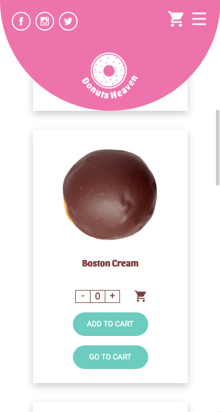

# Donuts Heaven

## Sections
* [Description](#Description)
* [How to Use](#How)
* [Technologies](#Technologies)
* [Contributions](#Contributions)

## Description

This is a simple simulation of a responsive site for a donuts store. 
It has five pages with a simple UI and information arquitecture. It's built with pure CSS and vanilla Javascript.  
The deployment can be seen [here]().

## How to use

The only requirement is to open it in a web browser.

## Technologies
* [Javascritp](https://github.com/ceciCoding/Donuts-store/tree/master/Scripts)
* [CSS](https://github.com/ceciCoding/Donuts-store/tree/master/CSS)

## Contributions
Contributions are welcome 🦄  
Feel free to fork and add your stuff!
